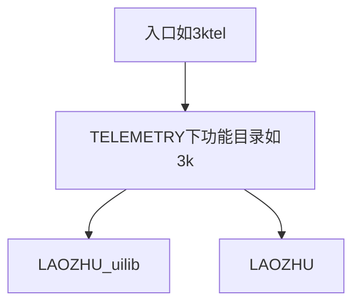

# CLAUDE.md

此文件为 Claude Code (claude.ai/code) 在此代码库中工作时提供指导。

## 项目概述

EdgeTX/OpenTX 遥控器脚本，用于 F3K（手抛滑翔机）和 F5J（电动滑翔机）比赛和训练辅助。该项目提供飞行数据记录、遥测显示和飞机调整工具，运行在搭载 EdgeTX 固件的遥控器上。

## 开发命令

### 安装和构建
- `install.bat [盘符:]` - 将脚本安装到遥控器SD卡（Windows）
- `./install_mac.sh [/Volumes/SD名]` - 将脚本安装到遥控器SD卡（macOS，挂载根目录下需有或自动创建 `SCRIPTS`）
- `build_sound_dll.bat` - 构建 Windows 声音库用于测试
- `build_sound_so.sh` - 构建 Linux 声音库用于测试

### 编译
- `cd SCRIPTS && lua GenCompileList.lua` - 生成编译文件列表（需 Lua 与 [LuaFileSystem](https://keplerproject.github.io/luafilesystem/) `lfs` 模块；会扫描 `../LAOZHU` 并输出 `LAOZHU/...` 条目）
- 脚本在遥控器首次运行时自动编译
- 当遥控器检测到缺失 .luac 文件时进行编译

### 测试
- **开发机 / CI**：在仓库根目录执行 `lua test/test.lua`（单元测试）；CI 在推送/PR 到 master 时通过 GitHub Actions 运行
- **macOS**：安装 LuaRocks 后执行 `luarocks install luaunit lua-mock`（与 CI 一致），再在仓库根执行 `./run_tests.sh`；脚本会调用 `luarocks path` 注入 `LUA_PATH`/`LUA_CPATH`，并用仓库内 [tools/lua/5.2.2](tools/lua/5.2.2/README.md) 的 Lua 5.2.2 与 CI 对齐
- **模拟器 / 遥控器（黑白屏）**：自动化测试入口为遥测脚本 `SCRIPTS/TELEMETRY/utO.lua`，用例脚本位于 `SCRIPTS/emutest/`
- **彩屏 WIDGET**：在 App 布局下添加 `WIDGETS/LzUtO` widget，与 `utO.lua` 相同批跑 `emutest/` 并可在跑完后演练 ViewMatrix 控件（需长按 ENT 交权后按键才生效）

## 架构

### 核心目录结构

仓库根目录与 SD 卡一致：**`SCRIPTS/`**（遥测脚本、`emutest/` 等）、**`LAOZHU/`**（核心库）、**`WIDGETS/`**（彩屏 widget）与 **`test/`**（开发机单元测试源码；安装到 SD 时为 `SCRIPTS/test/`）并列；SD 卡上亦为 `SCRIPTS`、`LAOZHU`、`WIDGETS` 同级。

**LAOZHU/** - 核心功能模块（与 `SCRIPTS/` 同级；脚本路径以 **`gSDCardDir`** 为 SD 卡根：`/`（真机/模拟器）或 `./`（本机跑 `test/test.lua`），`LAOZHU/...` 展开为 `gSDCardDir .. "LAOZHU/..."`，`SCRIPTS/` 下相对路径展开为 `gSDCardDir .. "SCRIPTS/..."`）
- **`LAOZHU/uilib/`**：可复用 EdgeTX UI 控件
- 状态管理类（F3kState.lua, F5jState.lua, SinkRateState.lua）
- 数据记录（F3kFlightRecord.lua, SinkRateRecord.lua, launchRecord.lua）
- 工作流实现（F3kWF/ 子目录）
- 工具函数（OTUtils.lua, LuaUtils.lua）
- 通用模块（comm/ 子目录）

**TELEMETRY/** - 用户界面与遥测入口层（位于 `SCRIPTS/` 下；各功能子目录承担场景侧业务编排与页面，详见下节「分层约定与参考范本」）
- 主入口点：3ktel.lua（F3K）、5jtel.lua（F5J）、adjust.lua（调整工具）
- UI 页面按功能组织（3k/, 5j/, adjust/ 等）
- 通用 UI 控件在 **`LAOZHU/uilib/`**（由各功能页面按需加载）

**data/** - 飞行数据存储
**test/** - 单元测试（仓库根目录，`SCRIPTS` 与 `WIDGETS` 共用逻辑的开发机测试）
**emutest/** - 模拟器/真机自动化用例（位于 `SCRIPTS/` 下，由 `TELEMETRY/utO.lua` 或彩屏 `WIDGETS/LzUtO` 加载）
**WIDGETS/** - 彩屏 Lua widget（SD 卡根目录下 `WIDGETS/`，与 `SCRIPTS` 同级）

### 分层约定与参考范本

**项目级原则**：全项目新增功能应遵循下列依赖关系；存量代码不要求一次性重构，在后续修改、排障或功能扩展时，在触及范围内借机向该模式收敛，避免为对齐而大面积重写。

- **新增功能**：按功能类型选择入口与 `TELEMETRY/<功能>/` 目录（例如 F3K、F5J、调整或未来新入口），但依赖方向保持一致：**薄入口** → **`TELEMETRY/<功能>/` 业务子模块**（页面与场景级编排、glue）→ **`LAOZHU/uilib/`**（可复用 UI 控件）与 **`LAOZHU/`** 下领域模块（不含 uilib）。
- **参考范本**：[SCRIPTS/TELEMETRY/3ktel.lua](SCRIPTS/TELEMETRY/3ktel.lua) 为可读示例——入口仅负责生命周期、分页表、`background`/`run` 等，不把业务堆在入口里；[SCRIPTS/TELEMETRY/3k/f3kCore.lua](SCRIPTS/TELEMETRY/3k/f3kCore.lua) 组装 `LAOZHU`；[SCRIPTS/TELEMETRY/3k/](SCRIPTS/TELEMETRY/3k/) 下各页面按需加载 `LAOZHU/uilib/` 控件，并通过 core / `LAOZHU` 暴露的接口驱动数据。
- **三层职责**：
  - **`SCRIPTS/TELEMETRY/<功能>/`**：该功能的业务子模块层（页面编排、`*Core` 等与场景绑定的组装；可在此加载 `LAOZHU` 并持有会话级状态，例如 `gF3kCore`）。
  - **`LAOZHU/uilib/`**：可复用 EdgeTX UI 控件；由各功能页面按需加载。载入/释放约定见下节 **uilib 内存约定**（沿用原 common UI 惯例）。
  - **`LAOZHU/`**（**除 `uilib/` 外**）：与具体页面解耦的领域逻辑（状态机、记录、工作流、`comm/` 等）；由功能侧 core 或等价模块加载，对页面暴露稳定接口；**不宜**让这些领域模块再依赖 **`LAOZHU/uilib/`**，以保持与界面 API 的边界清晰。
- **其它入口**：`5jtel.lua`、`adjust.lua` 及未来的遥测、Widget 等入口遵循同一套原则；具体对照仍以 `3ktel.lua` 与 `3k/` 为准。

#### uilib 内存约定

遥控器上 Lua 内存有限，`LAOZHU/uilib` UI 组件采用按需加载并从 `_G` 对称撤出的做法。完整约定拆成两篇，按角色查阅：

| 文档 | 读者 | 内容 |
|------|------|------|
| [LAOZHU/uilib/UI_COMPONENT_USAGE.md](LAOZHU/uilib/UI_COMPONENT_USAGE.md) | 页面与编排代码的作者 | **调用约束**：何时 `LZ_runModule`、`destroy`/局部卸载里调 `XXunload` 或清空 `O` 全局类、`Fields`/`keyMap`、自检清单 |
| [LAOZHU/uilib/UI_COMPONENT_IMPLEMENTATION.md](LAOZHU/uilib/UI_COMPONENT_IMPLEMENTATION.md) | 新增或修改 uilib 控件的人 | **实现约束**：`*O.lua` 语义、两字母前缀、`XXunload` 要写全、`O` 变体与卸载分工、自检与测试思路 |

依赖方向示意：



### 模块加载系统

入口脚本须先设置全局 **`gSDCardDir`**（SD 根：`"/"` 或测试时 `"./"`），再加载 `LAOZHU/uilib/LoadModule.lua`。使用自定义模块加载器：
```lua
LZ_runModule("LAOZHU/OTUtils.lua")   -- → gSDCardDir .. "LAOZHU/OTUtils.lua"
LZ_runModule("LAOZHU/uilib/Fields.lua")   -- → gSDCardDir .. "LAOZHU/uilib/Fields.lua"
LZ_loadModule("path/to/module.lua") -- 仅加载模块函数
```

脚本在首次运行时自动将 .lua 编译为 .luac 以提升性能。

### 关键配置文件

- `3k.cfg`, `5j.cfg` - F3K/F5J 功能的用户设置
- `launch.cfg`, `sinkrate.cfg`, `ld.cfg` - 调整工具的设置
- 配置通过 Cfg.lua/CfgO.lua 模块管理

## 开发说明

- 代码使用混合函数式/面向对象风格 - 面向对象提供清晰度，函数式用于内存控制
- 针对资源受限的遥控器环境设计
- 所有界面文本为中文（目标市场）
- 脚本必须与 EdgeTX Lua API 兼容
- 由于遥控器限制，内存管理至关重要
- 通过自定义 C++ 库（competition_lib/）提供声音反馈

### 日志原则（必须遵守）

遥测脚本、Widget、`LAOZHU` 中与调试/排障相关的输出须按分级使用 **`DBG_err`**（错误）与 **`DBG_dbg`**（调试），并完成 **`DBG_init`**；细则、开关语义与引导失败时的例外见 **[LOGGING_PRINCIPLE.md](LOGGING_PRINCIPLE.md)**。新增或修改代码时应打开该文档对照自检清单，避免滥用 `print`、级别错用或重复 `[ERR]`/`[DBG]` 前缀。

## 测试方法

- `test/` 目录下的单元测试使用自定义测试框架；开发机与 CI 上运行 `lua test/test.lua`
- 模拟器或真机（黑白屏）上运行 `SCRIPTS/TELEMETRY/utO.lua` 执行 `emutest/` 中的自动化用例
- 彩屏上安装 `WIDGETS/LzUtO` 后可在主屏/App 中执行同一批 `emutest/` 用例（见上文「彩屏 WIDGET」）
- CI 在 Ubuntu 上使用 Lua 5.2.2 运行测试
- 功能与 UI 仍建议在真实 EdgeTX 硬件或模拟器上手动验证