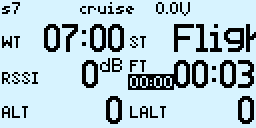

安装
====
1. 将"LAOZHU"、"TELEMETRY"两个目录copy到遥控器SD卡"SCRIPTS"目录下。
2. 进入遥控器"DISPLAY"设置界面，选择"3ktel"(for 3k)或者"5jtel"(for 5j)。 

3. 在遥控器主界面，长按摇杆"下"，进入"飞行信息"界面。  (3k飞行信息截图)
4. 连续按摇杆"右"，进入"设置"界面。  (3k设置界面截图)
5. 在选中的设置项上按摇杆"确定"，设置相应开关，再次按摇杆"确定"完成该开关设置。

3K使用指引
====
1. 设置工作时间： 
在"飞行信息"界面，按摇杆"上"、"下"移动焦点，选中工作时间，按摇杆"确定"进入工作时间设置，工作时间会闪烁，此时按摇杆"上"、"下"可改变工作时间。再次按"确定"，结束工作时间设置。 

2. 复位工作时间： 
拨动设置里选择的工作时间复位开关进行复位。

3. 设置目标飞行时间（可用于倒数QT）： 
在"飞行信息"界面，按摇杆"上"、"下"移动焦点，选中目标飞行时间，按摇杆"确定"进入目标时间设置，目标飞行时间会闪烁，此时按摇杆"上"、"下"可改变目标时间。再次按"确定"，结束目标飞行时间设置，在飞行时间达到目标时间15秒后，开始语音倒数。 

4. 记录飞行时间： 
从飞行模式"preset"进入飞行模式"zoom"时飞行时间计时器清零并且开始计时。 
 
 
从飞行模式"zoom"进入除"preset"外的飞行模式，计时器继续计时。 
 
正常飞行结束，进入一次飞行模式"preset"（按压发射按钮一次），进入降落状态，计时器停止计时，并且保存当前飞行记录。 

5. 查看飞行记录： 
在"飞行信息"界面，按摇杆"右"进入飞行记录界面，按摇杆"上"、"下"滚动记录。 

6. 设置： 
在"飞行信息"界面，连续按摇杆"右"进入设置界面，按摇杆"上"、"下"选中设置项，按摇杆"确定"进入设置，按摇杆"上"、"下"改变设置，再次按摇杆"确定"完成设置。 

