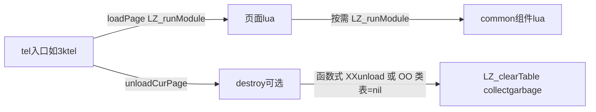

# TELEMETRY common UI 使用约定（调用侧）

写给**页面与功能编排代码**的作者：`TELEMETRY/common` 里的控件如何通过 `LZ_runModule` 接入，以及离开时如何对称释放。**不要**在未加载对应模块时使用其全局符号；**不要**在本页已不再需要时把导出长期留在 `_G`。

更细的语义与实现要求（`*O.lua`、两字母前缀、`XXunload` 怎么写）见 **[UI_COMPONENT_IMPLEMENTATION.md](UI_COMPONENT_IMPLEMENTATION.md)**。

## 原则

1. **只加载当前页或当前子场景需要的模块**——在页面顶层或与该场景绑定的局部 `loadModule` 里调用 `LZ_runModule(gSDCardDir .. "SCRIPTS/TELEMETRY/common/....lua")`（路径以仓库内实际为准），勿预加载本页不用的控件。
2. **离开时必须对称卸载**：谁加载了、谁就要在离开时释放挂到 `_G` 的那部分。**函数式**组件在页面的 `destroy`（或等价卸载钩子）里调用各 **`XXunload()``**；加载了 **`O` 变体**的模块时，在同一个 `destroy` 里把对应的**全局类表**逐项置 `nil`（与本页 `LZ_runModule` 过哪些文件一致）。
3. **服从入口生命周期**：典型遥测入口在换页前会调用 `curPage.destroy`（若存在），再 `LZ_clearTable(curPage)`、`collectgarbage()`（例如 `3ktel.lua`）。页面侧的 `destroy` 必须在此前把 common 导出清干净。

## 载入与离开时要做什么（速查）

| 你使用的形态 | 载入后如何使用 | 在页面 `destroy`（或局部 `unload`）里 |
|----|----|----|
| 函数式 common（如 `Button.lua`） | `LZ_runModule` 后用 `BTnewButton` 等与该模块一致的 API | 依次调用 **`XXunload()`**（与本页加载的模块列表一致）；注意依赖顺序，必要时与加载顺序对称 |
| `O` 变体（如 `ButtonO.lua`） | `LZ_runModule` 后用 `Button:new()` 等全局类 API | 将本页引入的**全局类名**逐项 **`= nil`**（与 `LZ_runModule` 的 OO 模块一致）；**勿依赖**单独的 `FooOunload`——通常不存在 |

`*O.lua` **不是「彩屏专版」**，只是面向对象实现；与同基名的无 `O` 模块应逻辑对齐。选用哪套由存量页面与约定决定。

## `Fields.lua`（调用侧）

若本页 **`LZ_runModule` 了 Fields** 并调用了 **`initFieldsInfo()`**，在 **`destroy` 里必须调用 `FieldsUnload()`**。参考 `3k/SetupPage.lua`。

## `keyMap.lua`（调用侧）

载入后 **`KMgetKeyMap()`** 取得映射表即可，随后立即 **`KMunload()`**，避免把按键模块的导出长期留在 `_G`。

## 子场景内多次进入/退出

同一功能里若有一组 common 只在某子界面需要，可用局部 **`loadModule` / `unloadModule`**：`unload` 里集中调用若干个 **`XXunload()`**（及必要的类表清空）。示例：`adjust/output.lua`。

## 页面作者自检

- [ ] `LZ_runModule` 列表仅包含本页/本子场景需要的 common。
- [ ] **`destroy`**（或等价钩子）中与载入对称：**`XXunload`**、`FieldsUnload`（若用过 Fields）、`**O`** 相关的全局类 **`= nil`**。
- [ ] 确认所属遥测入口在换页时会调 **`destroy`** 并 **`LZ_clearTable` + `collectgarbage`**（按该入口惯例）。
